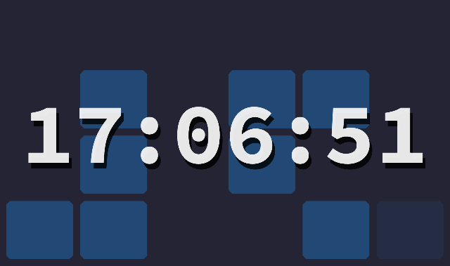

# binary_clock

This is a clock that displays the time in a high contrast very readable way and uses the background to also display a binary clock.

It has support for dark and light themes and 12/24h time.

You can see the clock live in Flutter Web at https://bylundia.se/flutter_clock
